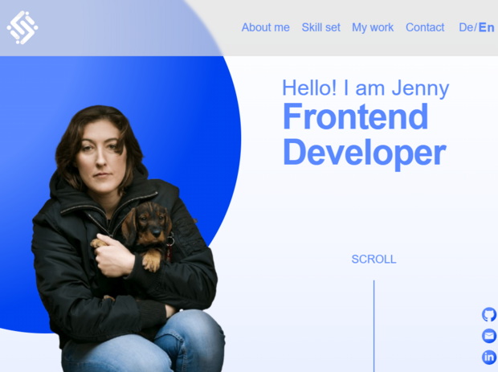

Personal portfolio website built with Angular 17 to showcase my work as a junior frontend developer, my technical stack, and selected projects. It’s designed to be fast, accessible, responsive, and easy to maintain.

- Live site: https://www.jennifer-thomas.de
- Repository: https://github.com/TerrorDackel/PortfolioJenniferThomas
- Email: contact@jennifer-thomas.de
- LinkedIn: https://www.linkedin.com/in/jennifer-thomas-595735360/

---

## Preview



---

## Features

- Single-page portfolio built with Angular 17 (standalone components)
- Clear section structure: hero, skill set, projects, references, contact
- Responsive layout for mobile, tablet and desktop
- Sass architecture with reusable mixins and consistent breakpoints
- Smooth scrolling and subtle reveal animations
- Internationalization (DE/EN) with JSON translation files
- External links to live demos and GitHub repositories of my projects
- Accessibility improvements (semantic HTML, readable font sizes, focus states where applicable)
- Form UX with inline validation feedback and success/error messaging

---

## Tech stack

- **Framework:** Angular 17 (standalone components)
- **Languages:** TypeScript, HTML5, Sass (indented syntax)
- **Tooling:** Angular CLI, npm
- **Quality:** ESLint (Angular ESLint)
- **Version control:** Git & GitHub

---

## Quality signals (Lighthouse)

> **How to run:** Open Chrome DevTools → Lighthouse (Desktop) → Generate report  
> or run: `npx lighthouse http://localhost:4200 --view --preset=desktop`

| Category | Score | Notes |
| --- | --- | --- |
| Performance | N/A (blocked in this environment) | Run Lighthouse locally and replace |
| Accessibility | N/A (blocked in this environment) | Run Lighthouse locally and replace |
| Best Practices | N/A (blocked in this environment) | Run Lighthouse locally and replace |
| SEO | N/A (blocked in this environment) | Run Lighthouse locally and replace |

---

## Key implementation details

- **Architecture:** Standalone components + routing, clean separation of layout (header/content/footer)
- **Styling:** Sass partials (`_core.sass`, `_responsive.sass`) + global utilities and mixins
- **i18n:** Translation files in `src/assets/i18n` (`de.json`, `en.json`)
- **UX:** Scroll helpers + lightweight animations (kept subtle to stay professional)

---

## Architecture & design decisions

- **Standalone components:** Simplifies module structure and keeps sections self-contained.
- **Translation pipeline:** Central JSON dictionaries keep text consistent and easy to update.
- **Responsive strategy:** Each section has dedicated `_responsive.sass` partials with shared mixins.
- **Progressive enhancement:** Features like reveal animations are subtle and optional.

---

## Feature deep dive

- **Navigation & language switcher:** DE/EN toggle updates UI copy via `@ngx-translate`.
- **Contact form flow:** Inline validation, privacy consent requirement, success/error feedback.
- **Project cards:** External links and short descriptions for recruiter-friendly scanning.

---

## Proof of work (project highlights)

- **Join:** Kanban-inspired task manager with drag-and-drop and assignment flows.
- **Pollo Loco:** Jump’n’Run with item collection and enemy interactions.
- **Pokédex:** PokéAPI-based catalog for viewing and filtering Pokémon data.

---

## Project structure (high level)

- `src/app` – root component, routing and application shell
- `src/app/header` – header, navigation and language switcher
- `src/app/content` – main sections (hero, skill set, projects, contact, etc.)
- `src/app/footer` – footer with legal links
- `src/assets` – images, icons and translation files (`i18n`)
- `src/styles` – global styles, mixins and shared utilities

---

## Getting started

### Prerequisites

- Node.js (LTS)
- npm (comes with Node.js)

### Install & run

```bash
npm install
npm start

# Production build
npm run build

# Lint
npm run lint

# Unit tests
npm test
```

---

## Testing

**Unit tests**
- Component tests cover navigation behavior, language switching, and the contact form flow.
- Run with: `npm test`

**Manual E2E smoke checks**
- Start the app with `npm start`.
- Verify navigation anchor links scroll to the correct sections.
- Switch language (DE/EN) and confirm the UI copy updates.
- Submit the contact form (with privacy consent) and confirm success/error feedback.